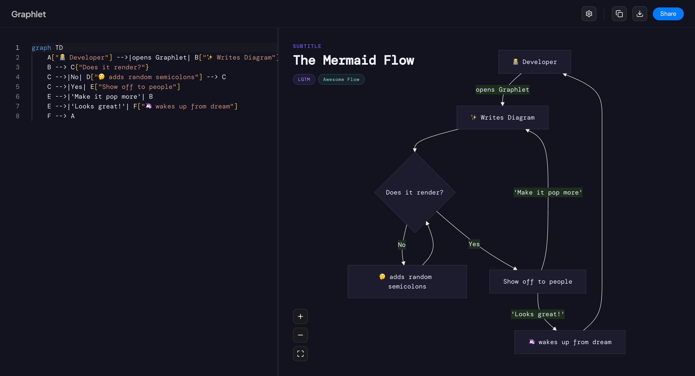

<p align="center">
  <h1 align="center">Graphlet</h1>
  <p align="center">
    A beautiful, modern Mermaid diagram editor — write, preview, and share diagrams instantly.
  </p>
</p>

<p align="center">
  
</p>

<p align="center">
  <a href="#features">Features</a> •
  <a href="#getting-started">Getting Started</a> •
  <a href="#tech-stack">Tech Stack</a> •
  <a href="#usage">Usage</a> •
  <a href="#license">License</a>
</p>

---

## Features

- ✏️ **Monaco Editor** — Full-featured code editor with Mermaid syntax highlighting, line numbers, and auto-completion
- 🔄 **Live Preview** — Real-time diagram rendering as you type, with smooth crossfade transitions
- 🔍 **Pan & Zoom** — Navigate large diagrams with intuitive pan and zoom controls
- 🎨 **Themes** — Multiple diagram themes (Default, Dark, Forest, Neutral) with a sleek dark editor
- 📤 **Export** — Download diagrams as PNG or SVG, or copy directly to clipboard
- 🔗 **Share & Embed** — Generate shareable links with compressed diagram state, or embed via `<iframe>`
- 🏷️ **Tags & Metadata** — Add a title, subtitle, and category tags to your diagrams
- ⚙️ **Settings Panel** — Customize themes and tags from a clean settings UI
- 💾 **Auto-Save** — Diagram state persists in `localStorage` — never lose your work

## Getting Started

### Prerequisites

- [Node.js](https://nodejs.org/) v18+
- npm (comes with Node.js)

### Installation

```bash
# Clone the repository
git clone https://github.com/your-username/Graphlet.xyz.git
cd Graphlet.xyz

# Install dependencies
npm install

# Start the dev server
npm run dev
```

The app will be running at `http://localhost:3000`.

### Build for Production

```bash
npm run build
npm run preview
```

## Tech Stack

| Layer | Technology |
|-------|-----------|
| Framework | [Nuxt 4](https://nuxt.com) (SPA mode) |
| UI | [Vue 3](https://vuejs.org) + Composition API |
| Editor | [Monaco Editor](https://microsoft.github.io/monaco-editor/) |
| Diagrams | [Mermaid.js](https://mermaid.js.org) |
| Pan/Zoom | [Panzoom](https://github.com/anvaka/panzoom) |
| Icons | [Lucide](https://lucide.dev) |
| Sharing | [Pako](https://github.com/nicolo-ribaudo/pako) (compression) |
| Fonts | Plus Jakarta Sans, Syne, DM Mono |

## Usage

1. **Write** — Type Mermaid syntax in the left-hand editor panel
2. **Preview** — Watch your diagram render in real-time on the right
3. **Customize** — Click the ⚙️ settings icon to change themes and add tags
4. **Export** — Use the toolbar buttons to copy, download (PNG/SVG), or share your diagram
5. **Share** — Click "Share" to generate a link or embeddable `<iframe>` code

### Supported Diagram Types

Graphlet supports all Mermaid diagram types including:

- Flowcharts
- Sequence Diagrams
- Class Diagrams
- State Diagrams
- Entity Relationship Diagrams
- Gantt Charts
- Pie Charts
- Git Graphs
- and more…

## Project Structure

```
Graphlet.xyz/
├── components/
│   ├── TheEditor.vue       # Monaco-based code editor
│   ├── ThePreview.vue      # Live diagram preview with pan/zoom
│   ├── TheToolbar.vue      # Top toolbar (logo, export, share)
│   ├── TheSettings.vue     # Theme & tag settings panel
│   └── TheShareModal.vue   # Share link & embed modal
├── composables/
│   ├── useEditorState.ts   # Editor & diagram state management
│   └── useShareState.ts    # Share/embed URL generation
├── pages/
│   ├── index.vue           # Main editor page
│   └── embed.vue           # Embeddable diagram view
├── assets/css/
│   └── main.css            # Global styles & design tokens
└── nuxt.config.ts          # Nuxt configuration
```

## License

MIT

---

<p align="center">
  Built with ☕ and <a href="https://mermaid.js.org">Mermaid.js</a>
</p>
